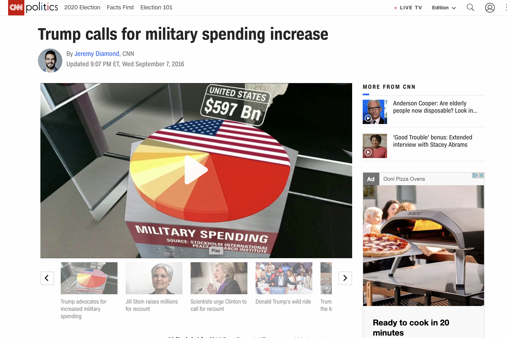
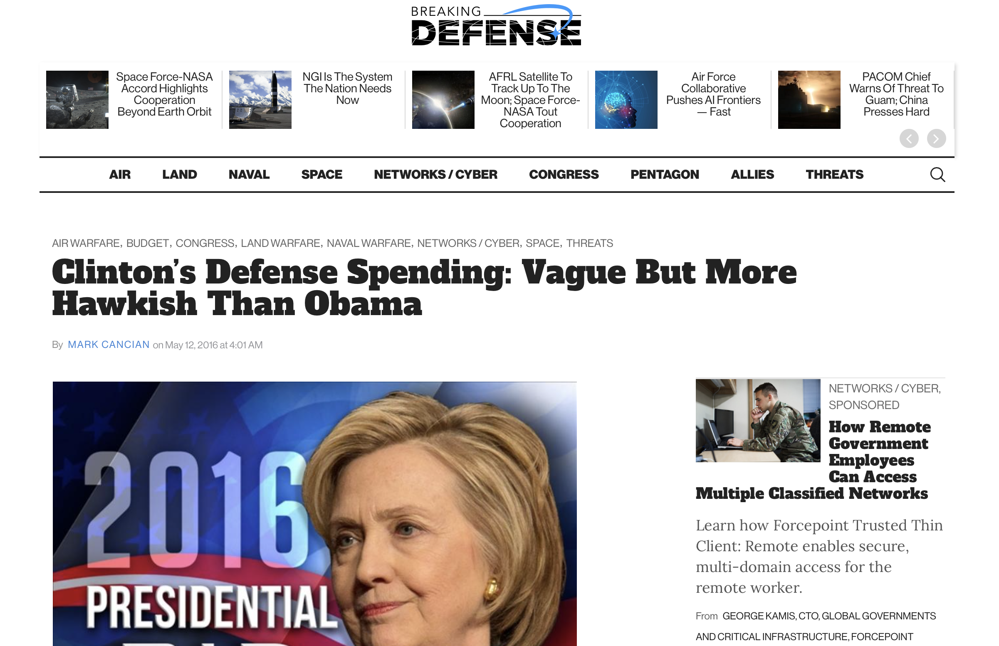

```{r setup, include=FALSE}
knitr::opts_chunk$set(echo = TRUE)
```

## setup data
```{r}
library(haven)
library(ggplot2)
library(dplyr)
library(reshape2)
library(ggpubr)
library(stringr)
library(plyr)
```

```{r}
raw_data <- read_sav('../data/anes_timeseries_cdf_sav/anes_timeseries_cdf.sav')
```

## Would president candidates' promises in election period be one of important factor in final result? 
Usually, at the beginning of election period, the president candidates would like to state their plans on spending in different areas, if they become president, to people to attract and receive more votes. Thus, I would like to figure out how important those plans are in final result. 

```{r}
Election_years=as.character(seq(1952, 2016, 4))
anes_data <- raw_data %>% 
  mutate(
    year=as_factor(VCF0004),
    D.Defense_spending_scale = as_factor(VCF9081), 
    D.Aid_to_blacks_scale = as_factor(VCF9084), 
    D.Government_health_insurance_scale = as_factor(VCF9085), 
    D.Government_services_spending_scale = as_factor(VCF9086), 
    D.Guaranteed_jobs_and_living_scale = as_factor(VCF9087), 
    D.Liberal_conservative_scale = as_factor(VCF9088), 
    R.Defense_spending_scale = as_factor(VCF9089), 
    R.Aid_to_blacks_scale = as_factor(VCF9092), 
    R.Government_health_insurance_scale = as_factor(VCF9093), 
    R.Government_services_spending_scale = as_factor(VCF9094), 
    R.Guaranteed_jobs_and_living_scale = as_factor(VCF9095), 
    R.Liberal_conservative_scale = as_factor(VCF9096) 
  ) %>%
  filter(year %in% Election_years) %>%
  select(year, 
         D.Defense_spending_scale, 
         D.Aid_to_blacks_scale, 
        D.Government_health_insurance_scale, 
        D.Government_services_spending_scale, 
        D.Guaranteed_jobs_and_living_scale, 
        D.Liberal_conservative_scale, 
        R.Defense_spending_scale, 
        R.Aid_to_blacks_scale, 
        R.Government_health_insurance_scale, 
        R.Government_services_spending_scale, 
        R.Guaranteed_jobs_and_living_scale, 
        R.Liberal_conservative_scale)
save(anes_data, file="../output/anes_data.RData")
```


```{r}
load(file="../output/anes_data.RData")
anes_nNAs <- anes_data %>% 
  group_by(year) %>%
  summarise_all(function(x){mean(!is.na(x))}) %>%
  data.frame() %>%
  melt(id.vars = 'year' )
ggplot(anes_nNAs, aes(x = year, y = value, fill = variable)) +
  geom_bar(stat = "identity") #, position = 'dodge')
#anes_nNAs - the proportion of anes_data not contains NAs

```
##NOTES: 
1) Before Year 1968 (including), there is no data for perceived positions. 
2) Data in Year 1999, 2012, 2016 is relatively more than the data in other years. 


```{r}

anes_2016 <- anes_data %>% filter(year == 2016)
anes_2016_republican <- anes_2016 %>%
  select(year, starts_with('R'))
anes_2016_Democratic <- anes_2016 %>%
  select(year, starts_with('D'))

anes_2016.defense_spending <- anes_2016 %>% 
  select(D.Defense_spending_scale, R.Defense_spending_scale)
anes_2016.aid_to_blacks <- anes_2016 %>% 
  select(D.Aid_to_blacks_scale, R.Aid_to_blacks_scale)
anes_2016.health_insurance <- anes_2016 %>% 
  select(D.Government_health_insurance_scale, R.Government_health_insurance_scale)
anes_2016.service_spending <- anes_2016 %>% 
  select(D.Government_services_spending_scale, R.Government_services_spending_scale)
anes_2016.guaranteed_jobs_and_living <- anes_2016 %>% 
  select(D.Guaranteed_jobs_and_living_scale, R.Guaranteed_jobs_and_living_scale)
anes_2016.liberal_conservative <- anes_2016 %>% 
  select(D.Liberal_conservative_scale, R.Liberal_conservative_scale)

p1.1 <- anes_2016.defense_spending %>% 
  melt(id.vars = NULL) %>% 
  ggplot(aes(x = value, group = variable, fill = variable)) +
  geom_bar(aes(y = ..prop..), position = 'dodge') +
  aes(stringr::str_wrap(value, 13))+
  xlab('defense_spending')+
  scale_fill_discrete(name = 'Party', label = c('Democratic', 'Republican')) + 
  coord_flip()
#1. Greatly decrease defense spending
#7. Greatly increase defense spending


p1.2 <- anes_2016.aid_to_blacks %>% 
  melt(id.vars = NULL) %>% 
  ggplot(aes(x = value, group = variable, fill = variable)) +
  geom_bar(aes(y = ..prop..), position = 'dodge') +
  aes(stringr::str_wrap(value, 13))+
  xlab('aid to blacks') + 
  scale_fill_discrete(name = 'Party', label = c('Democratic', 'Republican')) + 
  coord_flip()
#1. Government should help Blacks/minorities
#7. Blacks/minorities should help themselves


p1.3 <- anes_2016.health_insurance %>% 
  melt(id.vars = NULL) %>% 
  ggplot(aes(x = value, group = variable, fill = variable)) +
  geom_bar(aes(y = ..prop..), position = 'dodge') +
  aes(stringr::str_wrap(value, 13))+
  xlab('health insurance') + 
  scale_fill_discrete(name = 'Party', label = c('Democratic', 'Republican')) + 
  coord_flip()
#1. Government insurance plan
#7. Private insurance plan


p1.4 <- anes_2016.service_spending %>% 
  melt(id.vars = NULL) %>% 
  ggplot(aes(x = value, group = variable, fill = variable)) +
  geom_bar(aes(y = ..prop..), position = 'dodge') +
  aes(stringr::str_wrap(value, 13))+
  xlab('service spending') +
  scale_fill_discrete(name = 'Party', label = c('Democratic', 'Republican')) + 
  coord_flip()
#1. Gov't provide many fewer services, reduce spending
#7. Gov't provide many more services, increase spending


p1.5 <- anes_2016.guaranteed_jobs_and_living %>% 
  melt(id.vars = NULL) %>% 
  ggplot(aes(x = value, group = variable, fill = variable)) +
  geom_bar(aes(y = ..prop..), position = 'dodge') +
  aes(stringr::str_wrap(value, 13))+
  xlab('guaranteed jobs and living') +
  scale_fill_discrete(name = 'Party', label = c('Democratic', 'Republican')) + 
  coord_flip()
#1. Government see to job and good standard of living
#7. Government let each person get ahead on own


p1.6 <- anes_2016.liberal_conservative %>% 
  melt(id.vars = NULL) %>% 
  ggplot(aes(x = value, group = variable, fill = variable)) +
  geom_bar(aes(y = ..prop..), position = 'dodge') +
  aes(stringr::str_wrap(value, 12))+
  xlab('liberal conservative') +
  scale_fill_discrete(name = 'Party', label = c('Democratic', 'Republican')) + 
  coord_flip()

ggarrange(p1.1, p1.2, p1.3, p1.4, p1.5, p1.6, common.legend = TRUE)

```


```{r}
anes_2012 <- anes_data %>% filter(year == 2012)
anes_2012_republican <- anes_2012 %>%
  select(year, starts_with('R'))
anes_2012_Democratic <- anes_2012 %>%
  select(year, starts_with('D'))

anes_2012.defense_spending <- anes_2012 %>% 
  select(D.Defense_spending_scale, R.Defense_spending_scale)
anes_2012.aid_to_blacks <- anes_2012 %>% 
  select(D.Aid_to_blacks_scale, R.Aid_to_blacks_scale)
anes_2012.health_insurance <- anes_2012 %>% 
  select(D.Government_health_insurance_scale, R.Government_health_insurance_scale)
anes_2012.service_spending <- anes_2012 %>% 
  select(D.Government_services_spending_scale, R.Government_services_spending_scale)
anes_2012.guaranteed_jobs_and_living <- anes_2012 %>% 
  select(D.Guaranteed_jobs_and_living_scale, R.Guaranteed_jobs_and_living_scale)
anes_2012.liberal_conservative <- anes_2012 %>% 
  select(D.Liberal_conservative_scale, R.Liberal_conservative_scale)

# p1 <- anes_2012.defense_spending %>% 
#   melt(id.vars = NULL) %>% 
#   ggplot(aes(x = value, group = variable, fill = variable)) +
#   geom_bar(aes(y = ..prop..), position = 'dodge') +
#   aes(stringr::str_wrap(value, 13))+
#   xlab('defense_spending')+
#   scale_fill_discrete(name = 'Party', label = c('Democratic', 'Republican')) + 
#   coord_flip()
#1. Greatly decrease defense spending
#7. Greatly increase defense spending


p2.1 <- anes_2012.aid_to_blacks %>% 
  melt(id.vars = NULL) %>% 
  ggplot(aes(x = value, group = variable, fill = variable)) +
  geom_bar(aes(y = ..prop..), position = 'dodge') +
  aes(stringr::str_wrap(value, 13))+
  xlab('aid to blacks') + 
  scale_fill_discrete(name = 'Party', label = c('Democratic', 'Republican')) + 
  coord_flip()
#1. Government should help Blacks/minorities
#7. Blacks/minorities should help themselves


p2.2 <- anes_2012.health_insurance %>% 
  melt(id.vars = NULL) %>% 
  ggplot(aes(x = value, group = variable, fill = variable)) +
  geom_bar(aes(y = ..prop..), position = 'dodge') +
  aes(stringr::str_wrap(value, 13))+
  xlab('health insurance') + 
  scale_fill_discrete(name = 'Party', label = c('Democratic', 'Republican')) + 
  coord_flip()
#1. Government insurance plan
#7. Private insurance plan


p2.3 <- anes_2012.service_spending %>% 
  melt(id.vars = NULL) %>% 
  ggplot(aes(x = value, group = variable, fill = variable)) +
  geom_bar(aes(y = ..prop..), position = 'dodge') +
  aes(stringr::str_wrap(value, 13))+
  xlab('service spending') +
  scale_fill_discrete(name = 'Party', label = c('Democratic', 'Republican')) + 
  coord_flip()
#1. Gov't provide many fewer services, reduce spending
#7. Gov't provide many more services, increase spending


p2.4 <- anes_2012.guaranteed_jobs_and_living %>% 
  melt(id.vars = NULL) %>% 
  ggplot(aes(x = value, group = variable, fill = variable)) +
  geom_bar(aes(y = ..prop..), position = 'dodge') +
  aes(stringr::str_wrap(value, 13))+
  xlab('guaranteed jobs and living') +
  scale_fill_discrete(name = 'Party', label = c('Democratic', 'Republican')) + 
  coord_flip()
#1. Government see to job and good standard of living
#7. Government let each person get ahead on own


p2.5 <- anes_2012.liberal_conservative %>% 
  melt(id.vars = NULL) %>% 
  ggplot(aes(x = value, group = variable, fill = variable)) +
  geom_bar(aes(y = ..prop..), position = 'dodge') +
  aes(stringr::str_wrap(value, 12))+
  xlab('liberal conservative') +
  scale_fill_discrete(name = 'Party', label = c('Democratic', 'Republican')) + 
  coord_flip()


ggarrange(p2.1, p2.2, p2.3, p2.4, p2.5, common.legend = TRUE)
```

1) Compared with the graphs in Year 2012 and Year 2016, we could find the patterns of graphs in those two years are similar. As we could find, people didn't change their opinions towards Democratic Party and Republican Party in those two election seasons. However, in 2012 presidential election season, President Obama in Democratic Party won in final, while, in 2016 presidential election season, President Trump in Republican Party suceeded finally. 

2) Another information we could find from the graph is that, people derive news efficiently. Trump in Republican Party calls for military spending, so people who did the survey think Trump would increase defense spening if he is the future president. Hilary Clinton is considered to increase defense spending but not like Trump does, which is consistent with news.  




## Would people in different race have different opinions on the black people issues? 


```{r}
Election_years=as.character(seq(1952, 2016, 4))
anes_black <- raw_data %>% 
  mutate(
    year=as_factor(VCF0004),
    race = as_factor(VCF0105a),
    D.Aid_to_blacks_scale = as_factor(VCF9084), 
    R.Aid_to_blacks_scale = as_factor(VCF9092)
  ) %>%
  filter(year %in% Election_years) %>%
  select(year, race,
         D.Aid_to_blacks_scale, 
        R.Aid_to_blacks_scale, 
)

```


```{r}
anes_black_nNAs <- anes_black %>% 
  group_by(year) %>%
  summarise_all(function(x){mean(!is.na(x))}) %>%
  data.frame() %>%
  melt(id.vars = 'year' )
ggplot(anes_black_nNAs, aes(x = year, y = value, fill = variable)) +
  geom_bar(stat = "identity")

```

Because the lack of data in lots of year, I would like to focus on Year 2008, 2012 and 2016. 


```{r}
anes_black_count <- anes_black %>% filter(year %in% c(2008, 2012, 2016))%>% ddply(c("race", "D.Aid_to_blacks_scale"), "nrow", .drop = FALSE)

anes_black_year <- anes_black %>% filter(year %in% c(2008, 2012, 2016))
anes_black_nNAs <- na.omit(anes_black_year)

anes_prop_R <- left_join(anes_black_nNAs[-1] %>% group_by(race, R.Aid_to_blacks_scale) %>%
            dplyr::summarise(R.n = n()), 
          anes_black_nNAs[-1] %>% group_by(race) %>% dplyr::summarise(R.sum = n()), by = "race") %>% mutate(R.prop = R.n/R.sum)

anes_prop_D <- left_join(anes_black_nNAs[-1] %>% group_by(race, D.Aid_to_blacks_scale) %>%
            dplyr::summarise(D.n = n()), 
          anes_black_nNAs[-1] %>% group_by(race) %>% dplyr::summarise(D.sum = n()), by = "race") %>% mutate(D.prop = D.n/D.sum) 
```

```{r}
anes_prop_D
anes_prop_R
```

```{r}
anes_prop_D[order(anes_prop_D$D.prop, decreasing = TRUE), ]

```

```{r}
anes_prop_R[order(anes_prop_R$R.prop, decreasing = TRUE), ]
```
From the above result, we could find that, for the same party, people in different races may have different understandings in party's promise based on their race and profits. 
For the same plan of Democratic Party, one third of white people think that government provides huge amount of help to black people, but other race has a neutral opinion on aids to blacks. 
For the same plan of Republican Party, half of black people think the government doesn't provide enough aids to the Blacks and the Minorities. 

## Conclusion
1) The plans that president candidates state during election period does not have an important influence on election result. 

2) Different race have different opinions on the same politics that president candidate provides based on their race and profits. 


